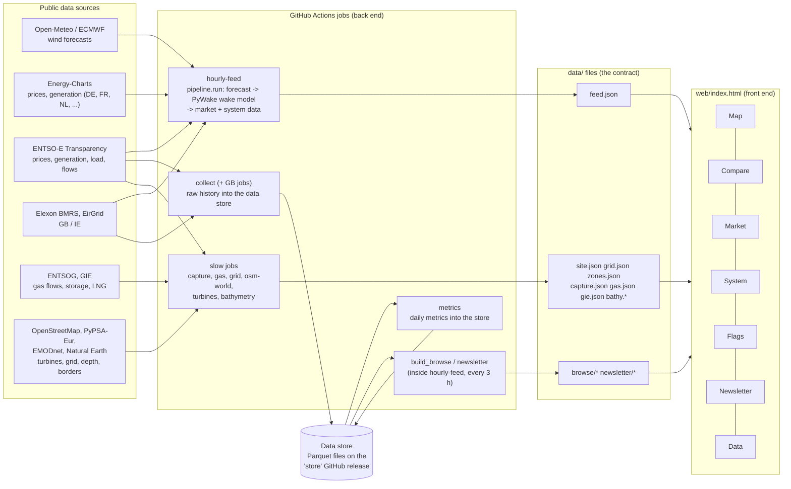

# How GridEconomics is put together

A plain-language map of the project: where the numbers come from, how they become files, and how the page turns
those files into tabs. Kept current with every structural change (spec 3). Last update: 4 Oct 2026.

## The short version

GridEconomics is a **static website**: GitHub Pages serves one HTML page plus a folder of data files. There is no server
that computes anything when you open the site. All the work happens beforehand, in **GitHub Actions** (scheduled jobs on
GitHub's machines), which fetch data from public sources, compute what the page needs and save it as files. The page
then only reads those files and draws them.

So there are two halves:

- **Back end** (Python, in `pipeline/`, `collector/`, `newsletter/`, `scripts/`): fetches and computes. Runs on GitHub
  Actions on a timetable.
- **Front end** (`web/index.html`: HTML, CSS and JavaScript in one file today): shows. Runs in your browser.

The **data contract** (`docs/DATA_CONTRACT.md`) is the list of files between the two halves.

## Diagram

## How data gets from a source to a tab (examples)

- **Romania's day-ahead price on the Map**: ENTSO-E publishes it -> `hourly-feed` (`pipeline/market.py`, `entsoe.py`)
  fetches it every hour -> `feed.json` `market.prices.RO` -> the page colours Romania on the map and draws its line in
  Market.
- **A Flags signal**: ENTSO-E prices and generation -> `collect` stores them in the data store every 2 h ->
  `build_browse.py` (inside `hourly-feed`, every 3 h) computes the daily metrics and percentiles (`newsletter/metrics.py`,
  `signals.py`) -> `browse/flags.json` and `browse/ts/RO.json` -> the Flags tab and its drill-down panel.
- **Wake losses of an offshore farm**: Open-Meteo / ECMWF wind -> `pipeline/run.py` runs PyWake for each farm ->
  `feed.json` `farms` -> Map and Compare. The map's live "what-if" wake drawing uses JavaScript copies of the same
  PyWake formulas (checked against PyWake by a test).
- **Capture prices**: ENTSO-E generation and prices -> `capture` job every 3 h -> `capture.json` (committed by a bot)
  -> Market tab.

## The jobs (workflows)

| Job | When | What it does |
|---|---|---|
| hourly-feed | every hour (:07, :37), on every push, after the data jobs | forecasts, PyWake, market and system data -> `feed.json`; every 3 h also the Data / Flags / Newsletter files; then publishes the site |
| collect | every 2 h + daily 12:35 UTC | ENTSO-E raw history into the data store |
| collect-gbie / gbhist / gbunits | every 2–6 h | GB and Ireland data into the store |
| metrics | after collect, daily 13:10 UTC | daily metrics into the store (`metrics_daily`) |
| capture | every 3 h | capture prices -> `capture.json` |
| gas | daily | ENTSOG and GIE -> `gas.json`, `gie.json` |
| grid, bathymetry, osm-world, turbines | monthly / on change | map layers -> `grid.json`, `bathy.*`, `site.json` |
| checks | every push | page syntax, Python tests, browser smoke test, code tidiness (no deploy) |

## Where things live

| Folder | What |
|---|---|
| `web/` | the page (today one file) and its `data/` folder |
| `pipeline/` | the hourly job: forecasts, wake model, market and system data |
| `collector/` | the data store and the collectors that fill it |
| `newsletter/` | daily metrics, signal rules (Flags), the newsletter draft |
| `scripts/` | one-off and scheduled data jobs, probes |
| `tests/` | Python tests, test data (`tests/fixtures/data/`), browser smoke test (`tests/e2e/`) |
| `docs/` | this page, the data contract, the decision log |
| `.github/workflows/` | the jobs above |

## Known weak spots (being addressed in spec 3)

- `web/` is both source and output: about a dozen scripts write into `web/data/`.
- Every push runs the whole hourly pipeline before the site updates (median ~6 min, often 15+; step 0 numbers in
  DEVNOTES.md). Planned fix: a separate fast deploy for page changes.
- The page is one 1,500-line file; planned split into one folder per tab.
